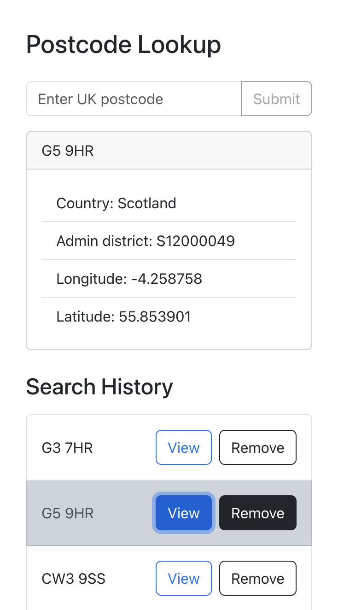

# React Postcode Lookup App

This project is a basic ReactJS application that allows users to submit a UK postcode, retrieves information about the postcode using the postcodes.io API, and displays relevant details to the user. Additionally, it keeps track of the history of postcodes the user has submitted, allowing them to view details and remove entries from the history list.

## [See Live site here](https://augustej.github.io/uk-postcodes)

## Screenshots


_Desktop view_

<div style="display: flex; gap: 20px;">
   
   
</div>

_Mobile view_

## Features

- Users can submit a UK postcode and view country, longitude, latitude, and admin district information.
- History of submitted postcodes is displayed, with the ability to select and view details.
- Postcodes can be removed from the history list

## Installation

1. Clone this repository:

   ```bash
   git clone https://github.com/augustej/uk-postcodes.git
   ```

2. Navigate to the project directory:

   ```bash
   cd uk-postcodes
   ```

3. Install dependencies:

   ```bash
   npm install
   ```

## Usage

1. Start the development server:

   ```bash
   npm start
   ```

2. Open your browser and navigate to `http://localhost:3000`.

3. Enter a UK postcode in the input field and submit.

4. View postcode details and history.

## Possible improvements

- Data does not persist on page reload - localStorage could be used.
- Styling is basic and made only with bootstrap - page look could be enhanced.

## Development process

1. **Project Setup**: Initialized the project using `create-react-app`.

2. **Core Features Development Order**:

   - **Input Form**: Developed the input form component.
   - **API Integration**: Integrated the postcodes.io API service using Fetch.
   - **History Implementation**: Added functionality to track user-submitted postcodes.

3. **Styling with Bootstrap**: Applied Bootstrap for responsive design and visual enhancements.

4. **Tests Addition**: Implemented unit and integration tests to ensure application reliability and correctness.

## Author

[augustej](https://augustej.github.io/)
